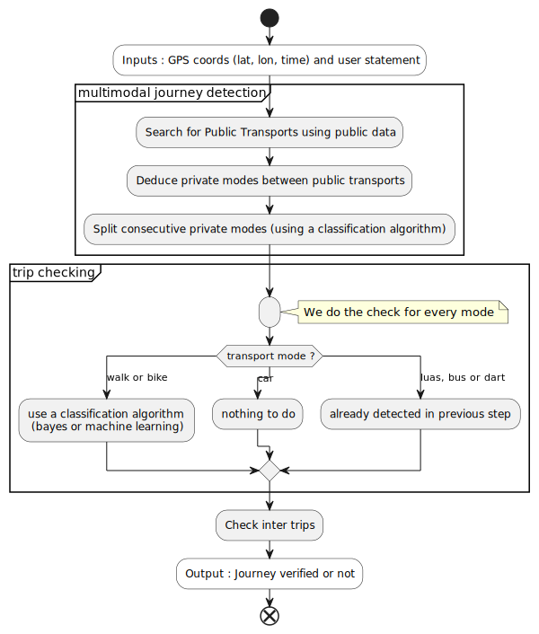

# Home of the algorithm to check users' journeys

To use it from an external point of view, the fonction to call is in the file 
`journey_checker.py` and is named `check_journey`

## Overview of the algorithm

The modes considered are :
- walk
- bike
- car
- luas (tramay)
- dart (train)
- bus

The algorithm takes as input a list of GPS coordinates (time, longitude, 
latitude) and a list of mode of transports stated by the user such as ('walk', 
'bus 1', 'bus 2').

It is divided in three parts :
1. **Multimodal journey detection**: as a journey can be composed of several mode 
  of transports, each part has to be identified

2. **Trip checking**: once each trip has been identified in step 1, they are 
  verified

3. **Check inter trips**: points between two modes of transport are checked 
  assuming they can only be walk (particularly between two public transports 
  when users are supposed to walk and this mode isn't explicitly declared by 
  them)

The algorithm use two main features :
- a classification algorithm : two methods were tested (a bayesian and a machine 
  learning method). Currently, the method used is the bayesian one.
- a public transport search : we use data issued by the city of Dublin to 
  verify that commuters' points match public routes.

## Main data structures

- **Modes of transport**:  
  Users have to say what modes of transport they are going to use. To store 
  this information, we use a list of pairs of values. Each pair represent a 
  mode of transport. The first element is a string containing the mode (e.g. 
  `'bus'` or `'bike'`) and the second one is the name of the route when the 
  mode is public. When the mode isn't public, the value has no importance (but 
  need to exist) and is usually `None` or `""`. For example, if users are 
  starting their journey by foot, then take a bus whose name is '4A' and 
  finish using a tramay (luas in Dublin) whose name is 'Green' then the modes 
  will be stored like that: `[('walk', None), ('bus', '4A'), ('luas', 'Green')]`

- **GPS records**:
  A GPS record, when saved in a file, is a field of three elements: the date of 
  the record in ISO format, the longitude in decimal and the latitude in 
  decimal. In Python, it's a tuple of `(str, float, float)`. Example 
  `("2022-01-19T16:35:50.935Z", -7.2364775, 52.9556583)`. The function used to 
  read the date is `datetime.fromisoformat` when the data is loaded.

- **Journey**:
  When stored in a file, a journey is a json file. The main difference with the 
  loaded in memory version is that the GPS data is a `pandas.DataFrame`

## GTFS datasets
Public transport data follows the [GTFS Format](https://gtfs.org/schedule/). 
Each mode of transport has it's own dataset. The most up to date data can be 
downloaded [here](https://www.transportforireland.ie/transitData/PT_Data.html).
